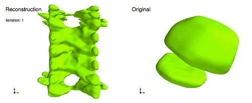
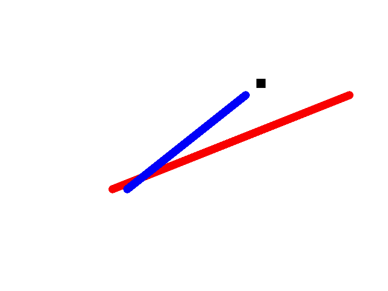
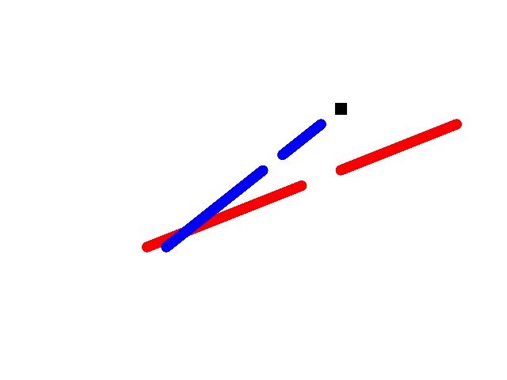
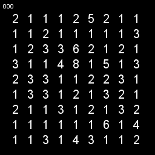
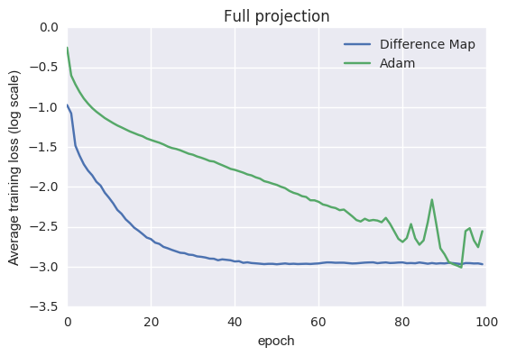
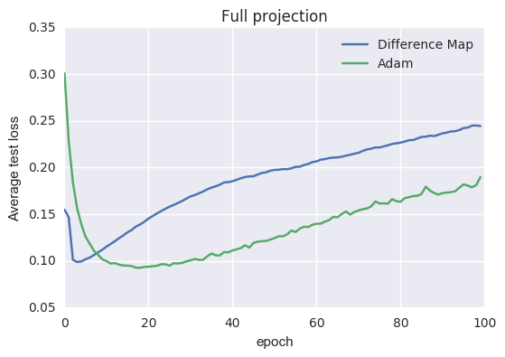
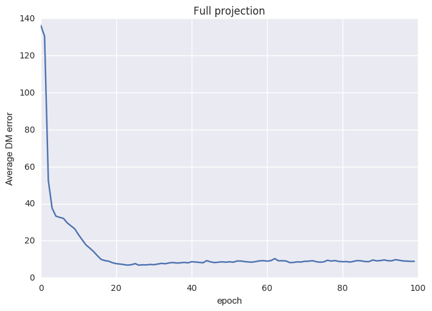
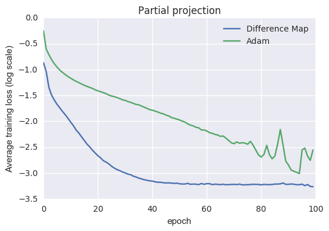
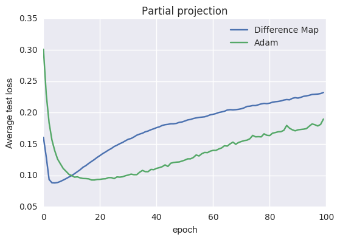
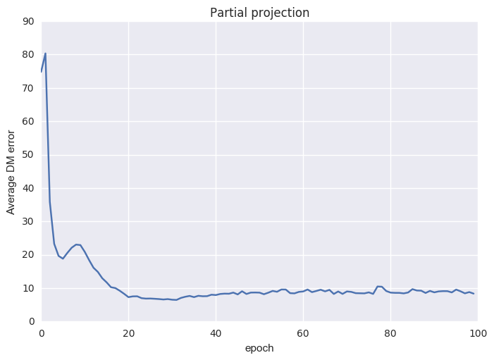

# Training neural networks with iterative projection algorithms
Jesse Clark 7 January 2017

Previously, I was working as a physicist in the area of [phase retrieval (PR)](https://scholar.google.com/citations?hl=en&user=Eighd10AAAAJ).  PR is concerned with finding the phase of a complex valued function (typically in Fourier space) given knowledge of its amplitude, along with constraints in real-space (things like positivity and finite extent)[Fienup1982].  

PR is a non-convex optimization problem and has been the subject of quite a lot of work [Fienup1982,Bauschke2002,Elser2003,Bauschke2003,Marchesini2003,Luke2005,Marchesini2007] and forms the backbone of crystallography, a stalwart of structural biology.  

Shown below is an example of the PR reconstruction process,
showing the real-space 3D density of a nano-crystal as it is reconstructed from 3D diffration data (Fourier amplitudes)[see [Clark2015] for more information].

Some of the most successful algorithms for the general PR problem are projection based methods, inspired by convex optimizations projection onto convex sets (for an excellent overview see [Marchesini2007]).  Due to the projection based methods success in PR, I wondered if it would be possible to train a neural net using something similar.  

## Alternating Projections

Projections onto convex sets (POCS) is a useful method for finding the intersection between convex sets.  A simple example is shown below, where we have two (approximately) convex constraint sets  (red) and  (blue).  The intersection is found by simply projecting onto each set consecutively via the iterated map:

where  are the projections onto their respective sets.  Projections are idempotent  and are distance minimizing;

 such that   is minimized.

The solution is found when 

The convexivity of the constraints sets allows lots of general conclusions to be drawn, even if there is little knowledge about the individual sets.  Unfortunately, when the constraint sets are non-convex, very few general results hold. Consequently, rather than finding the global solution, using simple alternating projections can result in stagnation at local minima.  An example of this is shown below, where the sets from the previous example are made to be non-convex, and the ability to find the intersection (global minima) is now highly dependent on the initial guess. 

Despite the loss of guarantees when the sets are no longer convex, projection methods can prove very useful and powerful for finding solutions to non-convex optimization problems.  Examples include Sudoku, the n-queens problem, graph-coloring and phase retrieval [Elser2008, Gravel2008].  

As I will discuss in the next section, to get projection methods to work with non-convex problems, the simple alternating projection algorithm needs to be modified.

## The Difference Map

One of the most successful non-convex projection algorithms is the difference map (DM)[Elser2003, Elser2007].  It is written as 

where 

where  and  are called estimates.
Once a fixed point has been reached,

this implies the two estimates are equal with a solution;

The difference map is connected to a number of different algorithms that existed in the PR literature (hybrid input-output [Fienup1982], relaxed averaged alternating reflections [Luke2005] and hybrid projection reflection [Bauschke2003]) by being a generalization or equivalent for particular hyper-parameters.

Rather than the form outlined above, a simpler version of the difference map is often used and is given by;

This simpler version generally performs well and reduces the number of projections required per iteration (the order of the projections can also be switched).  The term  is also known as the reflection operation and appears in many projection algorithms [Marchesini2007].

The same non-convex problem is shown below, but now using the difference map algorithm.  Rather than getting trapped in the local minima, the algorithm is able to escape, search more of solution space, and finally converge onto a solution.

## Divide and Conquer

The difference map was previously defined for two projections, so what happens when there are more than two?  In this case we define a new iterate  which is the concatenation of  duplicates via [Gravel2008]:

and then define an average and direct product projection;

where  is the l'th projection and  is the weighted sum;

The difference map for many projections is then;

,

and the update follows the same as before;

.

This approach is known as 'divide and conquer'.  Below is an example of the iterates of a Sudoku puzzle as it converges using the difference map with divide and conquer.  

The Sudoku has 4 constraints, that each row has the numbers 1 to 9, that each column has the numbers 1 to 9, that the 3x3 sub-squares have the numbers 1 to 9 and finally that the numbers agree with the partially filled template. See <a href='https://github.com/jn2clark/sudoku-difference-map'> here </a> for code implementing this.

<h2> Projections for training a neural network </h2>

Now we have an understanding of the difference map, projections, and its use in non-convex optimization, the next step is to make projections for training a neural network.  In this example, we will consider a classification task only.  The basic idea is that we are seeking a vector of weights **_w_** that correctly classify our data _J_.  
If we break the data into _K_ subsets, 

we can then define a projection that 'projects' the weights so that all the training data in the subset are correctly classified (or the loss goes to 0).  In practice, the projection is achieved using gradient descent on the subset of data (basically to the point of overfitting).  If this is done, we get impotence and a distance minimizing operation.  The goal is then to have weights that correctly classify each subset of data and we want to find the intersection of all these sets.  Although this might not quite be a true projection, empirically we know that using the difference map in a non-convex setting (for example, PR), pseudo projections and non-optimal projections can still work very well, provided they behave like a true projection in the vicinity of the solution (i.e. we don't want it to diverge at the solution).  

<h2> Results </h2>

To test the training scheme (code <a href="https://github.com/jn2clark/nn-iterated-projections/tree/master/code"> here </a>), I trained a deliberately small network (due to time constraints and that fact I am using an old MacBook) using pretty standard methods (Adam [Kingma2014]) and compared that to the projection based method.  Very simple layers are used (i.e. no batch normalization), and consisted of a network of about 22000 parameters, 1 convolutional layer with 8 3x3 filters and 2 subsampling, 1 fully connected layer (using rectified linear units for the activations) with 16 nodes each and finally 10 softmax outputs (1 for each class of MNIST).
Shown below is the average training and test loss and accuracy for the MNIST dataset from 5-fold cross validation (using the MNIST training data only) for the difference map training and a conventional training scheme (using Adam, learning rate of .001, a batch size of 256 and no dropout or regularization).

We can see that it actually works! Converging nicely.  For the setup here, the training data was divided (randomly)
into 3 sets of equal size.  These three sets of training data were used in the projection constraint.  For the projection, technically we need to find the new set of weights that minimize the distance with the old set of weights.  Here to approximate that, we use gradient descent (using Adam, lr=.001, batch_size=256, no dropout or regularization) and terminate the projection once the training data reaches an accuracy of 99 (this is a heuristic that I came up with and there are probably much better ones, but this will do for now).
This step then consists of taking the weights and projecting onto each of the 3 sets by optimizing with respect to the loss function to produce 3 new sets of weights, which are concatenated together to form 

 
The average projection is then calculated by averaging the weights together and then duplicating and concatenating to form a new vector 

.  
These two projection steps are then combined as per the difference map to provide an update scheme for the weights.  

In addition to conventional metrics, we can also monitor the difference map error to look for convergence.  The difference map error is defined by;

where the lower the value, the closer to a solution.  With real-world data, it is entirely possible that there is no intersection between the constraint sets.  In this case the difference map error will reach a plateau, indicating that a near solution has been found and if the data is of significant quality then the iterate is trapped and will not diverge.  Qualitatively, the difference map error generally exhibits a sudden drop [Elser2003] before plateauing indicating it has reached a solution.

In the above example, the projection was defined by repeated gradient steps on the subset of training data, essentially to the point of overfitting.  What would happen if we do not train on the subset until the point of overfitting? 
In the example below, we now terminate the projection after a single epoch rather than letting it run until we reached our heuristic validation limit on the training data.

Shown below are the average test and train errors (compared to the same conventional training as above)

As we can see, it still works well.  Why is this so? If the projection operation is terminated earlier, one way to think of this is simply as treating the projection as a relaxed projection or a non-optimal projection.  Results from convex optimization and PR [Elser2003, Marchesini2003,Thibault2013,Clark2014] still show that relaxed projections and non-optimal projections still converge (often very well) to the solution.  
Additionally, in this limit single epoch projection limit, the conventional gradient descent based training regime can be recovered (using 3 sets as an example) via alternating projections;

Finally, a small grid-search (using 5-fold cross validation) was done over some of the hyper-parameters - batch-size, learning rate and iterations for the conventional method and batch_size, learning rate, iterations and epochs for the projections.  The optimal parameters were found to be (learning rate .001, batch size 256 and 17 epochs) for the conventional training and (learning rate .001,batch size 1024, and 7 epochs) for the projection method.  Training the networks with these parameters and performing early stopping (at the iteration found to have the lowest cv test error) gave a final loss and accuracy respectively of 0.0724 and 97.5% for the conventional training method, and .0628 and 97.9% using the difference map.

## Extending projection methods

One of the nice things about projection methods is the ease of which you can incorporate additional constraints.  

For the case of L1 regularization we can define a shrinkage or soft-thresholding operation (which is part of the proximal gradient descent algorithm) as;

.
Other projections could be histogram constraints on the weights or symmetries on convolution kernels.

## Other considerations
There are lots of unanswered questions that I did not explore here.  What is the optimal number of sets? How should the data be distributed to these sets? How should the projection operation work? How should the state-fullness of the optimizers be handled?  Other things not fully explored are the effects of regularization.  Should this go into the projections themselves or be included as a projection (as per above)?  What happens if the weights are weighted differently in the averaging projection?  How should these be calculated?  Can averaging over near-solutions help with generalization?
Although there are lots of questions still to be answered, the re-framing of the training using lessons from phase retrieval and non-convex projection methods provides some interesting results.
 
## References 

[Fienup1982] J.R. Fienup, "Phase retrieval algorithms: a comparison". Applied Optics 2758-2769 (1982). 

[Bauschke2002] H.H. Bauschke, P.L. Combettes, and D.R. Luke, "Phase retrieval, error reduction algorithm, and Fienup variants: a view from convex optimization". Journal of the Optical Society of America A. 19:1334-1345 (2002). 

[Bauschke2003] Bauschke H H, Combettes P L and Luke D R "Hybrid projection–reflection method for phase retrieval" J. Opt. Soc. Am. A 20 1025–34 (2003).

[Elser2003] V. Elser, 'Phase retrieval by iterated projections', J. Opt. Soc. Am. A/Vol. 20, (2003).

[Marchesini2003] S. Marchesini, H. He, H. N. Chapman, S. P. Hau-Riege, A. Noy, M. R. Howells, U. Weierstall, and J. C. H. Spence, "X-ray image reconstruction from a diffraction pattern alone" Phys. Rev. B 68, 140101 (2003).

[Luke2005] Luke Russel D, “Relaxed averaged alternating reflections for diffraction imaging” Inverse problems, 21, 37-50 (2005).

[Thibault2006] Pierre Thibault, Veit Elser, Chris Jacobsen, David Shapiro and David Sayre, 'Reconstruction of a yeast cell from X-ray diffraction data', Acta. Cryst. (2006).

[Elser2007] V. Elser, et al. "Searching with iterated maps" 104 (2), 418-423 (2007).

[Marchesini2007] S. Marchesini, "A unified evaluation of iterative projection algorithms for phase retrieval",  Review of Scientific Instruments 78 (2007).

[Gravel2008] S. Gravel, V. Elser, "Divide and concur: A general approach to constraint satisfaction". Physical Review E. (2008).

[Thibault2013] Pierre Thibault& Andreas Menzel, "Reconstructing state mixtures from diffraction measurements"", Nature 494, 68–71 (2013).

[Kingma2014] Diederik Kingma, Jimmy Ba, "Adam - A Method for Stochastic Optimization" (http://arxiv.org/abs/1412.6980v8) (2014).

[Clark2014] J. N. Clark, X Huang, RJ Harder, IK Robinson, "Dynamic Imaging Using Ptychography""
Physical Review Letters 112, 113901 (2014).

[Clark2015] Jesse N. Clark,	Johannes Ihli,	Anna S. Schenk,	Yi-Yeoun Kim,	Alexander N. Kulak,	James M. Campbell,	Gareth Nisbet,	Fiona C. Meldrum	& Ian K. Robinson	"Three-dimensional imaging of dislocation propagation during crystal growth and dissolution", [Nature Materials](http://www.nature.com/nmat/journal/v14/n8/pdf/nmat4320.pdf) 14, 780–784 (2015)

